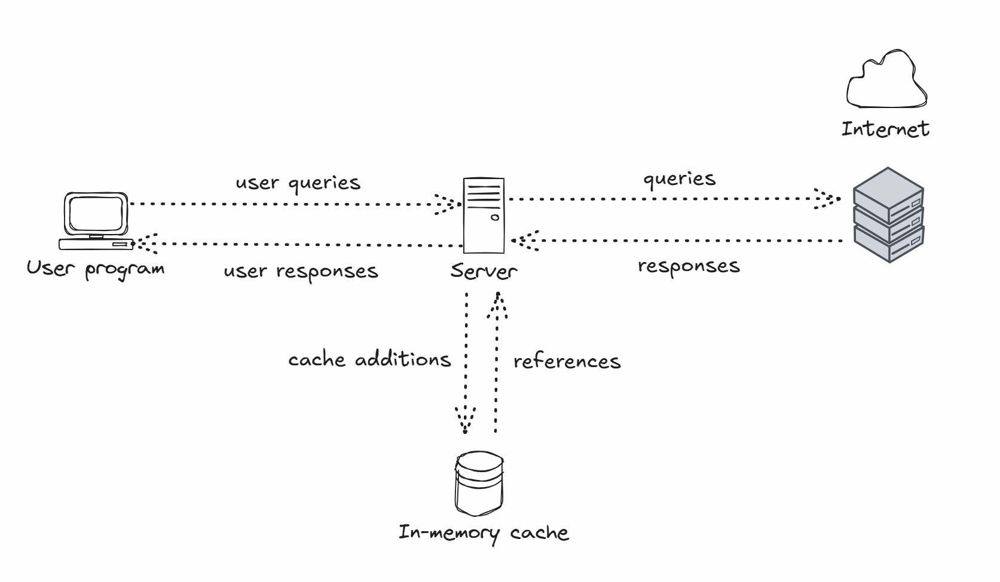
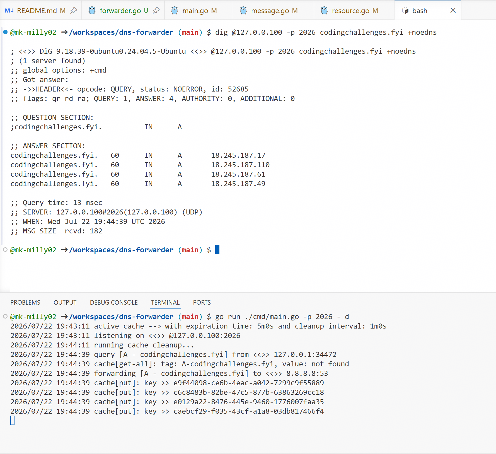

# DNS Forwarder

A lightweight DNS forwarder written in **Go** that implements a recursive DNS resolver with local caching.

The resolver listens for DNS queries over UDP, checks a local cache for existing records, and forwards unresolved queries to an upstream DNS server. Responses from the upstream server are cached based on their TTL before being returned to the client.

This project was built primarily as a learning exercise to better understand:

- DNS message encoding and decoding
- UDP networking in Go
- Recursive DNS resolution
- DNS caching
- Resource Record parsing
- RFC 1035

---

## Features

- UDP DNS server
- DNS packet parser
- DNS packet encoder
- Recursive forwarding to upstream DNS server
- Local in-memory cache
- TTL-based cache expiration
- Supports multiple DNS questions in a single query
- Parses DNS headers, questions, answers, authority, and additional sections
- Logging for incoming queries and cache operations

---

## Architecture



### Request Flow

1. Client sends a DNS query.
2. Resolver parses the DNS packet.
3. Resolver checks whether the requested records exist in cache.
4. If all requested records exist:
   - Respond immediately from cache.
5. Otherwise:
   - Forward unresolved questions to an upstream DNS server.
6. Parse the upstream response.
7. Cache all cacheable Resource Records.
8. Return the completed DNS response to the client.

---


## Running

Clone the repository

```bash
git clone https://github.com/mk-milly02/dns-forwarder.git

cd dns-forwarder
```

Run

```bash
go run ./cmd/main.go -p xxxx -d
```

The server listens on

```
127.0.0.100:xxxx
```

Example query

```bash
dig @127.0.0.100 -p 2026 google.com +noedns
```

---

## Cache

The resolver maintains an in-memory cache indexed by:

```
<Record Type>-<Domain Name>

Example:

A-google.com
AAAA-google.com
MX-google.com
```

Each cached entry stores:

- Resource Record
- TTL
- Expiration time

Expired records are automatically removed by a background cleanup routine.

---

## DNS Packet Format

A DNS message consists of:

```
+----------------------+
| Header               |
+----------------------+
| Question             |
+----------------------+
| Answer               |
+----------------------+
| Authority            |
+----------------------+
| Additional           |
+----------------------+
```

## Example

```
Client
   |
   | Query: A example.com
   |
Resolver
   |
   | Cache miss
   |
Forward to 8.8.8.8
   |
Receive Response
   |
Cache Answer
   |
Return Response
```

Subsequent requests for `example.com` are served directly from cache until the TTL expires.



---

## Current Status

Implemented

- UDP server
- DNS message parsing
- DNS message serialization
- Recursive forwarding
- DNS cache
- TTL expiration
- Multiple-question handling

Planned

- TCP fallback
- DNSSEC & EDNS support
- Negative caching
- LRU cache eviction
- Metrics endpoint
- Configuration file
- Integration tests
- Docker support

---

## References

- RFC 1035 - Domain Names - Implementation and Specification
- RFC 1034 - Domain Names - Concepts and Facilities
- https://codingchallenges.fyi/challenges/challenge-dns-forwarder

---

## License

MIT
